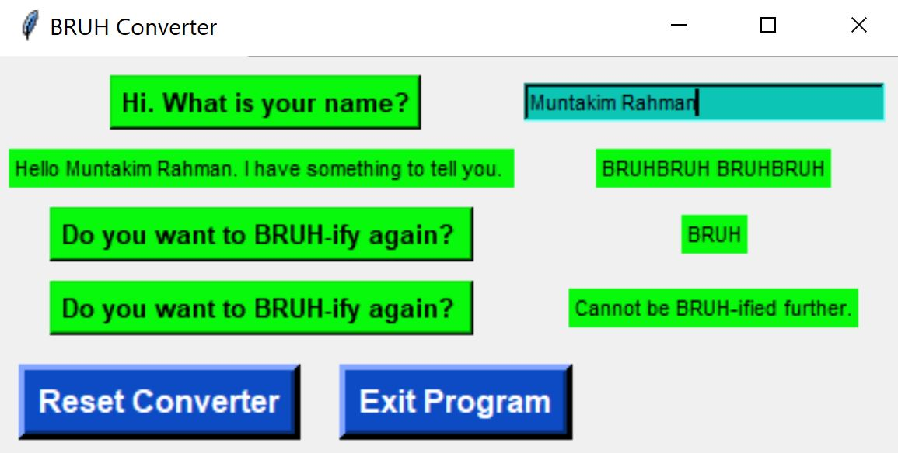

# BRUH Exploration

## Contents
* [Overview](#Overview)
* [BRUH Converter](#BRUH-Converter)
    * [BRUH Reducer](#BRUH-Reducer)
* [Tkinter GUI](#Tkinter-GUI)

## Overview
This is a rather juvenile project which was inspired by a meme I was browsing during class in my 2nd Undergraduate Year of <b>Electrical and Computer Engineering</b> at the <b>University of British Columbia</b>. Initially this was intended to be programmed in <b>C</b> to apply recently learned concepts from <b>CPSC 259 - Data Structures and Algorithms for Electrical Engineers</b>. However, due to the simple and dynamic aspect of <b>Python Programming</b>, it was decided to practice more general programming concepts in the latter language.

## BRUH Converter
The basis of the project is a simple converter which acquires the user's name and converts it to instances of the phrase **BRUH**. If a word has at least 2 letters, it translates to a single **BRUH** appended to the converted string. Another **BRUH** is appended after every 4 letters of the original string.

### BRUH Reducer
To take the described procedure a step further, the **BRUH** concatenations are reduced by a factor of 4. If the converted phrase has at least 2 **BRUH** phrases, they are reduced to a single **BRUH** phrase.

Here is an example of an Input/Output Combinations for this **BRUH** Conversion.

## Tkinter GUI
This is the stage where the project started to become a more general exploration. I added a <b>Graphical User Interface</b> for the functionality from the previous sections. The [(interface.py)](interface.py) <b>Python</b> file must be run to execute the **BRUH** conversion.

## Chatbot

I intend to add a chatbot functionality post **BRUH** conversion which is somewhat intelligent and carries out a conversation with the user to store details about them.
